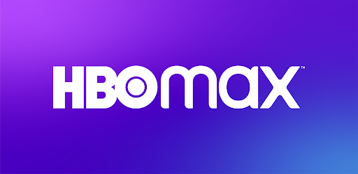

# HBO Max Clone Inspo

<h1 align="center">
    
</h1>


## About

A HBO MAX Clone Build in React

The aim of this project was to study how React components works and also practice some CSS

You Can Also Check a live demo on netlify by clicking the image below:

<br/>

<p align="center">
  <a href="http://playhbomax.netlify.com/" target="_blank">
    
  </a>
</p>


## 🛠 Stack
The Project was mainly build using :

- [React](https://reactjs.org/)
- [Styled Components](https://styled-components.com/)
- [React Loading Skeleton](https://www.npmjs.com/package/react-loading-skeleton)
- [Axios](https://axios-http.com/docs/intro)
- [TheMovieDb API](https://developers.themoviedb.org/3)
## Installing and Starting

In order to install and run the project, follow the steps below:
### Installing

Clone Repo:
```
git clone https://github.com/fillipeags/HBOmax-clone.git
```
or
```
git clone git@github.com:fillipeags/HBOmax-clone.git
```

### Start

Step 1 : Run ```yarn``` in order to install the required dependencies.
Step 2 : Run ```yarn start``` to initialize the project
